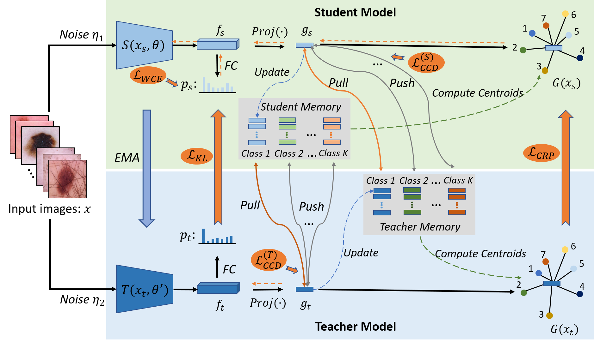

# CRCKD


This repository is an official PyTorch implementation of the paper 
**"Categorical Relation-Preserving Contrastive Knowledge Distillation for Skin Lesion Classification"
accepted to **MICCAI 2021**.



## Installation
### Dependencies
* Python 3.6
* PyTorch >= 1.5.0
* numpy
* pandas
* scipy
* sklearn
* tensorboardX
* torchvision


## Usage


### Baseline 1: DenseNet 121
```shell script
python3 train_CRCKD.py --exp sup4_base
```

### Baseline 2: DenseNet 121 + conventional Mean Teacher (MT)
```shell script
python3 train_CRCKD.py --ema_consistency 1  --exp sup4_pred_MT
```

### CRCKD: baseline + pred_MT + 0.1 * CRD_20pos + CRP
```shell script
python3 train_CRCKD.py --ema_consistency 1 --CRD_distill 1 --CRD_b4_weight 0.1 --mode multi_pos --nce_p 20 --AR_distill 1 --exp sup4_pred_MT_0.1CRD_20pos_CRP
```


### Main Scripts
```shell script
· cv_splits.py: Split all data into five folds for cross validation.

· train_CRCKD.py: Model training.

· validation.py: Evaluation of the model predictions.

· dataloader/dataset.py: Dataset with memory bank and contrastive samples.

· utils/memory.py: Construct memory banks that supply positive and negative samples.

· utils/CRD_CRP_loss.py: Definition of the CCD and CRP modules proposed in our method.
```


## Citation
If you find the codes useful, please cite the following publication:
```shell script
@article{xing2021categorical,
  title={Categorical Relation-Preserving Contrastive Knowledge Distillation for Medical Image Classification},
  author={Xing, Xiaohan and Hou, Yuenan and Li, Hang and Yuan, Yixuan and Li, Hongsheng and Meng, Max Q-H},
  journal={arXiv preprint arXiv:2107.03225},
  year={2021}
}
```


## Contact

If you have any problems in the codes, please contact xhxing@link.cuhk.edu.hk.

